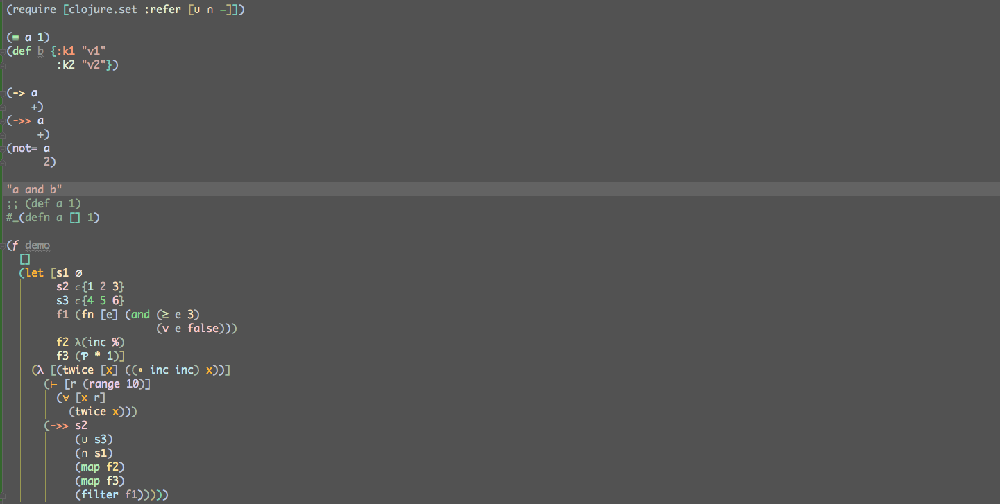
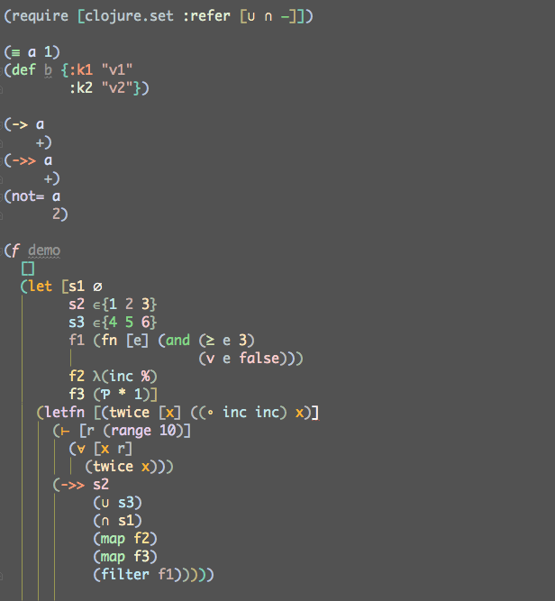
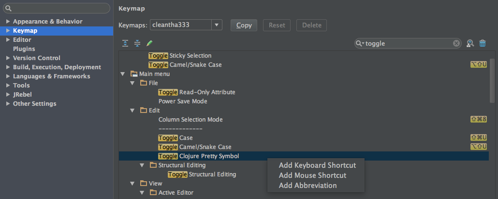

## Clojure Pretty Symbol Plugin

https://plugins.jetbrains.com/plugin/8224

## Snapshots

## Shortcuts

* ⌘- (Collapse)
* ⌘+ (Expand)
* ⇧⌘- (Collapse All)
* ⇧⌘+ (Expand All)

## Available pretty symbols

| original | concealed |
|---|---|
| `def` | `≡` |
| `defn` | `ƒ` |
| `fn` | `λ` |
| `letfn` | `λ` |
| `#(...)` | `λ(...)` |
| `let` | `⊢` |
| `doseq` | `∀` |
| `->` | `→` |
| `->>` | `⇉` |
| `partial` | `Ƥ` |
| `comp` | `∘` |
| `not=` | `≠` |
| `and` | `∧` |
| `or` | `∨` |
| `not` | `¬` |
| `>=` | `≥` |
| `<=` | `≤` |
| `#{...}` | `∈{...}` |
| `#{}` | `∅` |
| `union` | `⋃` |
| `intersection` | `⋂` |
| `difference` | `−` |

## Configuration

* it's better to use a clear Foreground and Background color for Folded text.

* to turn on or turn off specific pretty symbol.

* after you click `apply` button, every change on settings panel will be applied to all open files in current editor.

## Actions

* `Toggle Clojure Pretty Symbol` action will turn on / off pretty symbols globally.

* you can just click `Edit > Toggle Clojure Pretty Symbol` button on the menu, or bind a shortcut from the keymap.

## Development

* `./gradlew runIdea`
* `./gradlew buildPlugin`
* `./gradlew test`

## License

Copyright © 2016 zjhmale

Released under the terms of the MIT License
