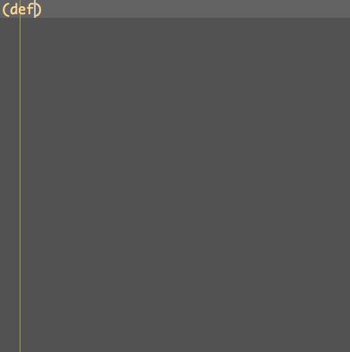
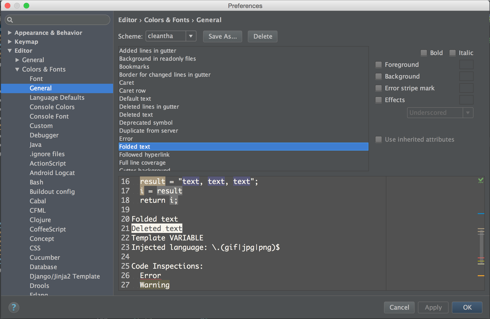
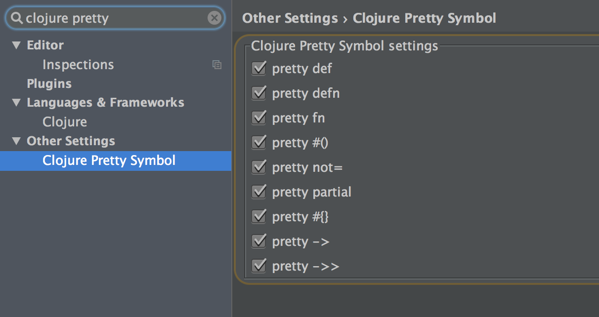

## Clojure Pretty Symbol Plugin

https://plugins.jetbrains.com/plugin/8224

## Snapshots

## Shortcuts

* ⇧⌘- (Collapse All)

* ⇧⌘+ (Expand All)

## Configuration

* it's better to clear Foreground and Background color for Folded text.

* to turn on or turn off specific pretty symbol.

## Development

* `./gradlew runIdea`
* `./gradlew buildPlugin`
* `./gradlew test`

## License

Copyright © 2016 zjhmale

Released under the terms of the MIT License
